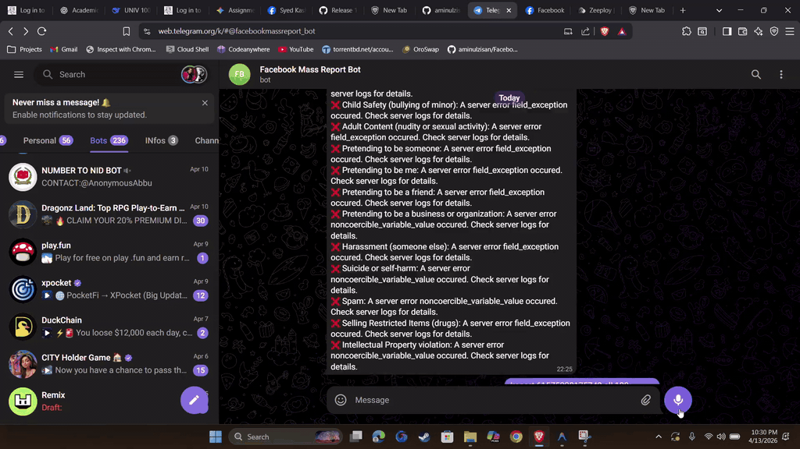
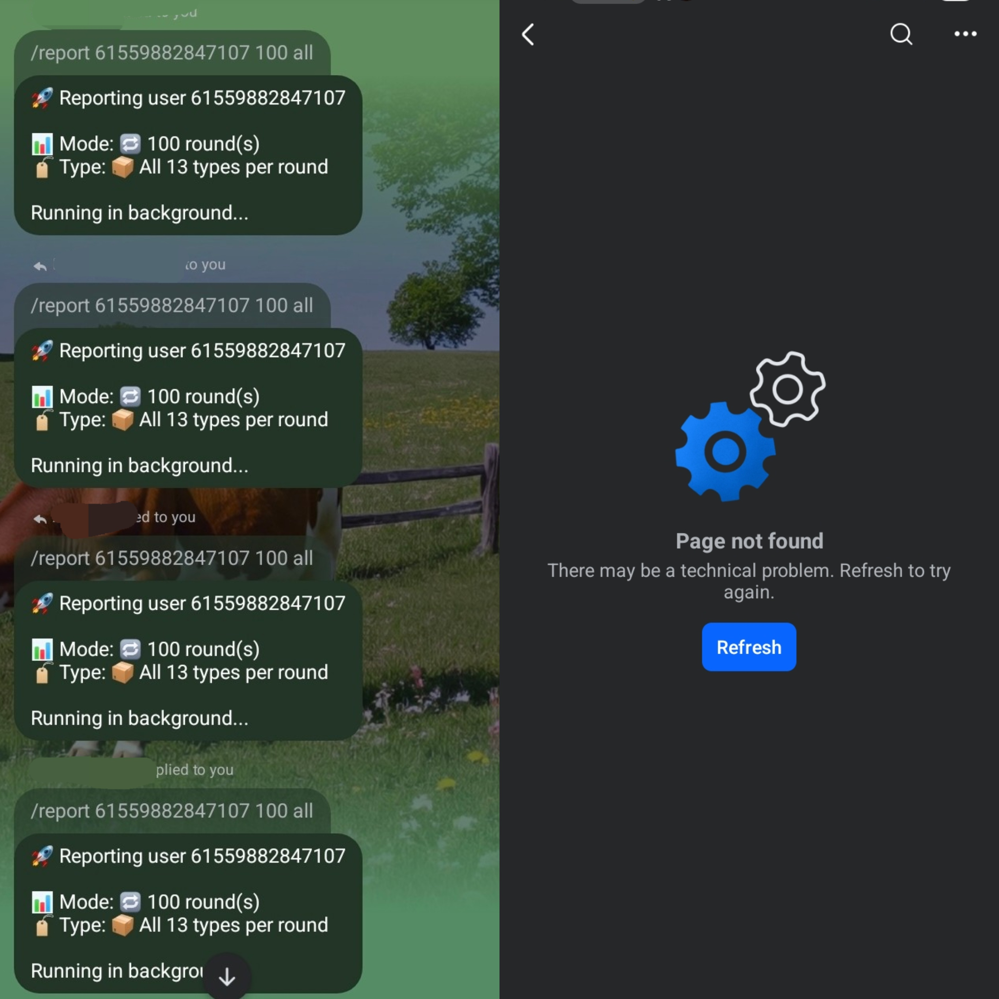

# 🚀 Facebook Mass Report Tool

> A powerful automated tool to mass report any Facebook account using cookies ⚡

---

## 🎬 Live Preview

  

  <a href="./Live_Proof.mp4">▶️ Watch Full Video</a>

---

## 📸 Interface Preview

  

---

## 🔥 Features

- ⚡ **Ultra-fast mass reporting**
- 🍪 **Cookie-based authentication system**
- 🤖 **Fully automated workflow**
- 💻 **Beginner-friendly interface**
- 🔒 **Private & secure tool**
- 📈 **High success rate reporting system**

---

## 🧠 How It Works

1. Add valid Facebook cookies  
2. Select target account/page/group  
3. Start automated reporting  
4. Tool handles the rest 🚀  

---

## 📦 Access & Availability

This is an **exclusive tool** 💎

If you are interested in getting access, feel free to contact me directly:

👉 **Telegram:** https://t.me/aminulzisan  

---

## 🛠️ Setup

- Complete setup guide will be provided upon obtaining access
- No advanced technical knowledge required  

---

## ⚠️ Disclaimer

This project is shared for **educational purposes only**.  
Any misuse of this tool is strictly the user's responsibility.  
The developer will not be responsible for any actions performed using this tool.

---

## ⭐ Support

If you like this project:

- ⭐ Star the repository  
- 🔗 Share with others  

---

## 💬 Contact

For support, business inquiries, or to request access:

👉 https://t.me/aminulzisan
